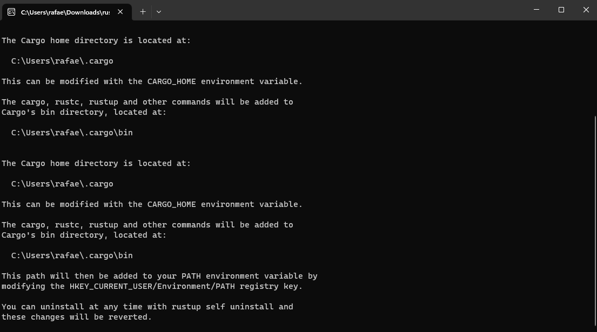
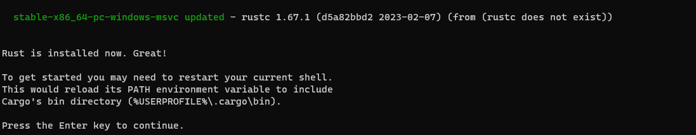
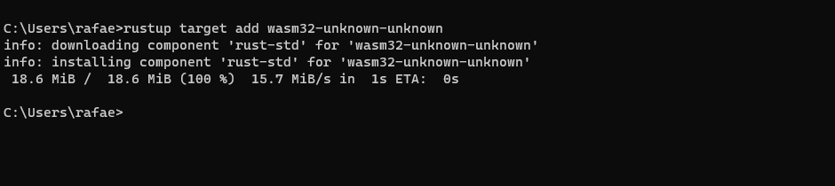
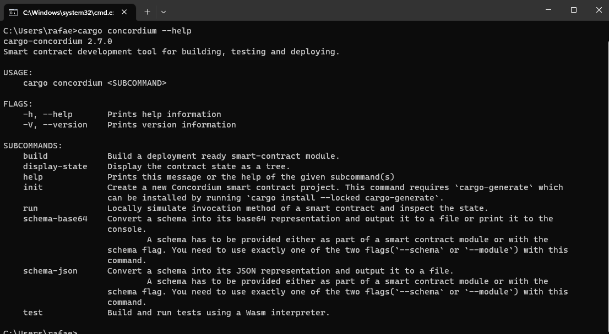
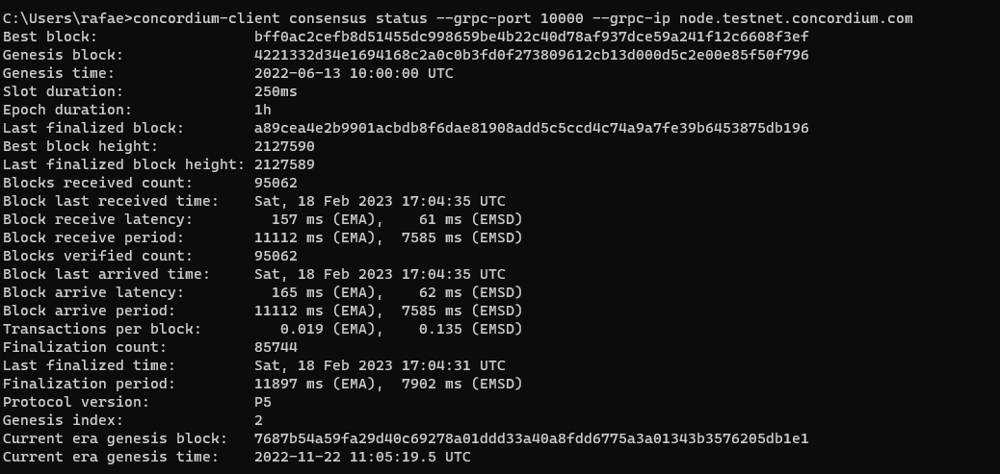
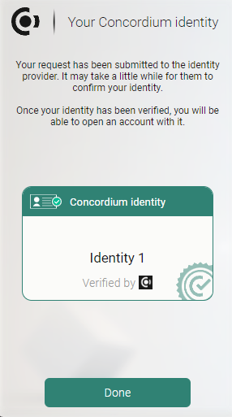
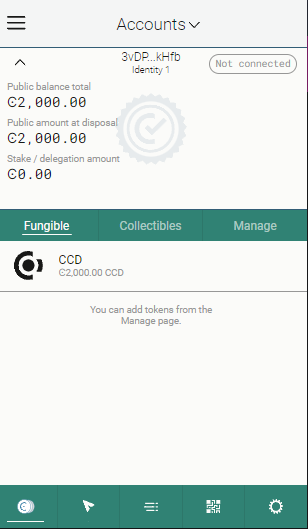
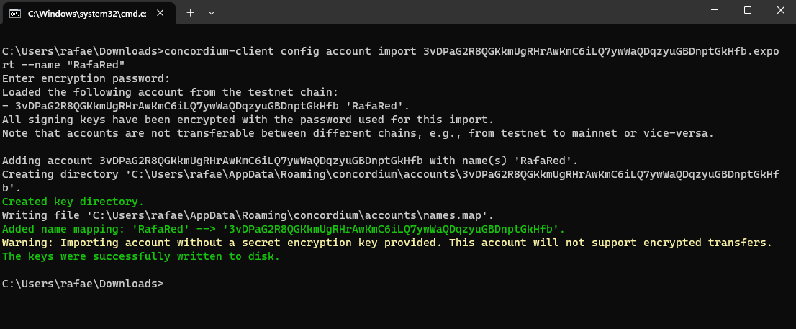

# Concordium Hackathon - Task 1
### install rust
exec https://win.rustup.rs/x86_64 then rustup target add wasm32-unknown-unknown

### install cargo-concordium
Download and exec https://distribution.concordium.software/tools/windows/signed/cargo-concordium_2.7.0.exe

### concordium-client
download and exec https://distribution.concordium.software/tools/windows/signed/concordium-client_5.0.2-0.exe

### testnet account
install plugin https://chrome.google.com/webstore/detail/concordium-wallet/mnnkpffndmickbiakofclnpoiajlegmg?hl=en-US and
creating the identify and account then acquiring testnet CCD via the CCD faucet

### export-import 
exporting wallet account from browser then importing into concordium client
concordium-client config account import <YOUR PUBLIC ADDRESS.export> --name <Your-Wallet-Name>

https://developer.concordium.software/docs/quick-start/testnet-accounts/
https://developer.concordium.software/docs/concordium-client/importing-an-account/

### mainnet wallet
49uuxBMFX4K2wRb1ivyV8PKw9ANSi2XGqLpeKgypBjGf6VXVMV
